# WEB SOLUTION WITH WORDPRESS 

## In this project we will prepare storage infrastructure on two Linux servers and implement a basic web solution using WordPress.

WordPress is a free and open-source content management system written in PHP and paired with MySQL or MariaDB as its backend Relational Database Management System (RDBMS).

The Project will consist of two parts:

1. Configure storage subsystem for Web and Database servers based on Linux OS. 
2. Install WordPress and connect it to a remote MySQL database server. 

### Three-tier Architecture
Generally, web, or mobile solutions are implemented based on what is called the Three-tier Architecture.

**Three-tier Architecture** is a client-server software architecture pattern that comprise of 3 separate layers.

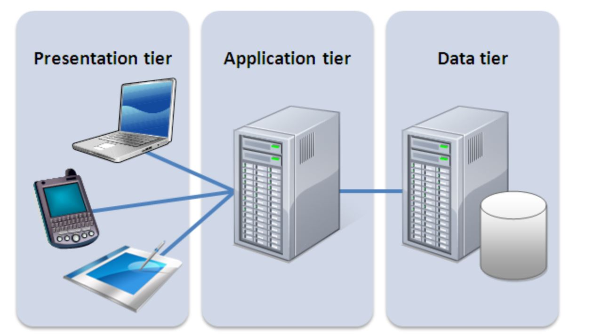

1. **Presentation Layer (PL):** This is the user interface such as the client server or browser on your laptop.
2. **Business Layer (BL):** This is the backend program that implements business logic. Application or Webserver
3. **Data Access or Management Layer (DAL):** This is the layer for computer data storage and data access. Database Server or File System Server such as FTP server, or NFS Server

#### In this project, we will showcase Three-tier Architecture while also ensuring that the disks used to store files on the Linux servers are adequately partitioned and managed through programs such as gdisk and LVM respectively.

### Our 3-Tier Setup
1. A Laptop or PC to serve as a client
2. An EC2 Linux Server as a web server (This is where we will install WordPress)
3. An EC2 Linux server as a database (DB) server

#### *We will be using **RedHat** OS for this project*

1. We launch 2 instances that will serve as a ***WEB SERVER*** and ***DB SERVER***.
##### *Take note of the **Availability Zones** for the 2 instances*
2. Attach all 3 volumes one by one to your Web Server EC2 instance
#### Click on **Volumes**, under Elastic Block Store(EBS).
#### Click on ***Create Volumes***

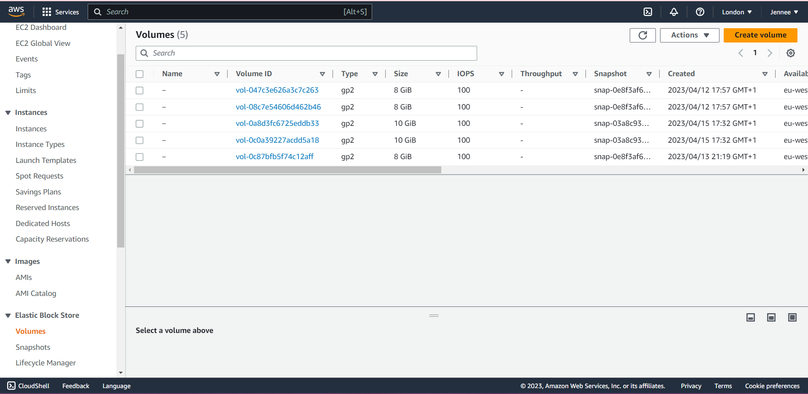

#### Change the Size to 10GB, and change to the correct *Availability Zone*. Then click on *Create Volume*

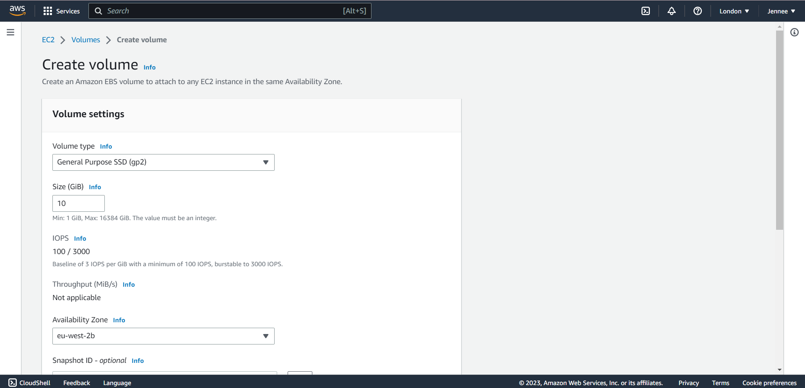
###### *Create 2 more Volumes*

#### Next, attach the *Volumes*

##### Under Instance field, search for the name of the instance you want to attach it to, and select it, then Save
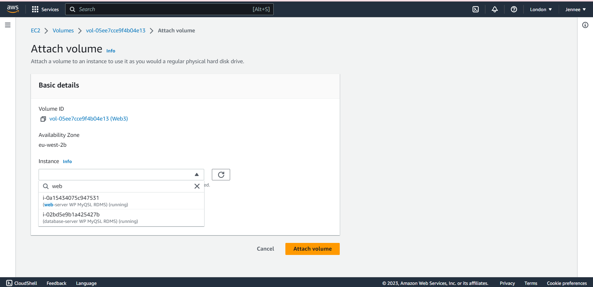
###### *Attach the other 2 Volumes*

## PREPARE THE WEB SERVER
#### Go to Instances and copy the SSH Key for "Web Server"

#### Then go to a Terminal, `cd` to where your ***pem*** file is located and connect to the ***Web Server*** instance using the SSH Key:
>`ssh -i "Jennee-EC2.pem" ec2-user@ec2-35-179-94-141.eu-west-2.compute.amazonaws.com`

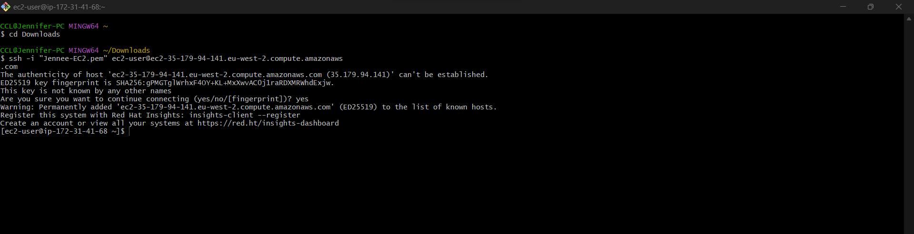

#### Next, open the ***/etc/hostname***
>`vi /etc/hostname`

#### Replace the ***IP address*** with the name ***webserver***.
#### Click on ***esc*** and `:wq` + **enter**

#### Then run this command:
>`sudo hostname webserver`

#### Then disconnect from the instance and reconnect for changes to take effect.
###### This process is used to identify the terminal as ***web server*** so as to differentiate it from the ***database server***.

3. To inspect what block devices are attached to the server, run this command:
>`lsblk`
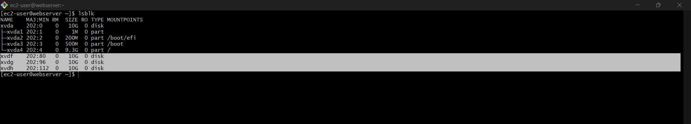

#####  All devices in Linux reside in **/dev/** directory. Inspect it with `ls /dev/` and make sure you see all 3 newly created block devices there – their names will likely be ***xvdf, xvdh, xvdg***.

4. Use `df -h` command to see all mounts and free space on your server.

5. Use **gdisk** utility to create a single partition on each of the 3 disks
>`sudo gdisk /dev/xvdf`

#### Type "**?**" to display the available options. 

#### Type ***n*** to create a new partition

#### Type *1* for partition number
#### Click ***enter*** for the next 2 prompts.

#### Change the ***partition type*** to *Linux LVM* by typing 8e00

#### Type `p` to check what you've done

#### Then type `w` to write and type `yes` to confirm
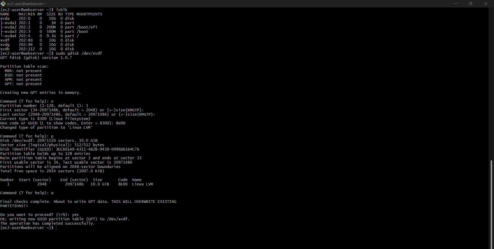

###### Repeat the process for the the three disks i.e /dev/xvdf, /dev/xvdg. /dev/xvdh.

#### Use `lsblk` utility to view the newly configured partition on each of the 3 disks.
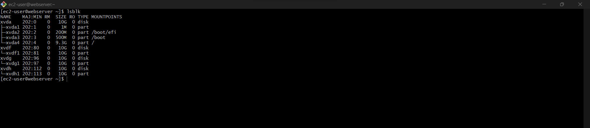

6. Next, Install lvm2 package using this command:

>`sudo yum install lvm2`

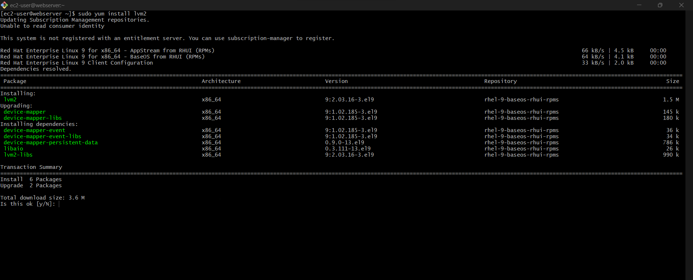
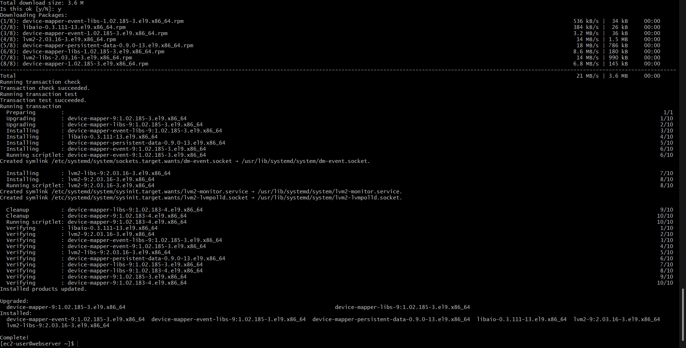

#### Run `sudo lvmdiskscan` to check for available partitions.


7. Use ***pvcreate*** utility to mark each of 3 disks as physical volumes (PVs) to be used by LVM:
>`sudo pvcreate /dev/xvdf1 /dev/xvdg1 /dev/xvdh1`

8. Verify that your Physical volume has been created successfully by running:
>`sudo pvs`

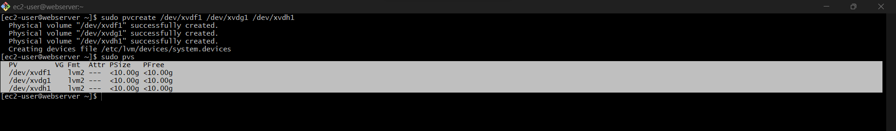

9. Use ***vgcreate*** utility to add all 3 PVs (Physical Volumes) to a volume group (VG). Name the VG ***webdata-vg***
>`sudo vgcreate webdata-vg /dev/xvdh1 /dev/xvdg1 /dev/xvdf1`

10. Verify that your VG has been created successfully by running `sudo vgs`
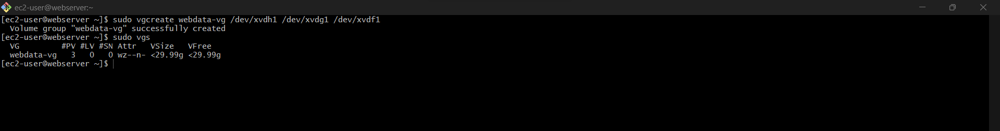

11. Use ***lvcreate*** utility to create 2 logical volumes. apps-lv (Use half of the PV size), and logs-lv Use the remaining space of the PV size. 
NOTE: ***apps-lv*** will be used to store data for the Website while, logs-lv will be used to store data for logs.
>`sudo lvcreate -n apps-lv -L 14G webdata-vg`

>`sudo lvcreate -n logs-lv -L 14G webdata-vg`

12. Verify that your Logical Volume has been created successfully by running:
>`sudo lvs`

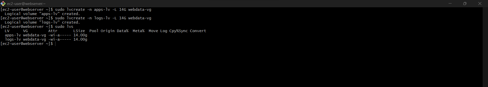

13. Verify the entire setup
>`sudo vgdisplay -v #view complete setup - VG, PV, and LV`

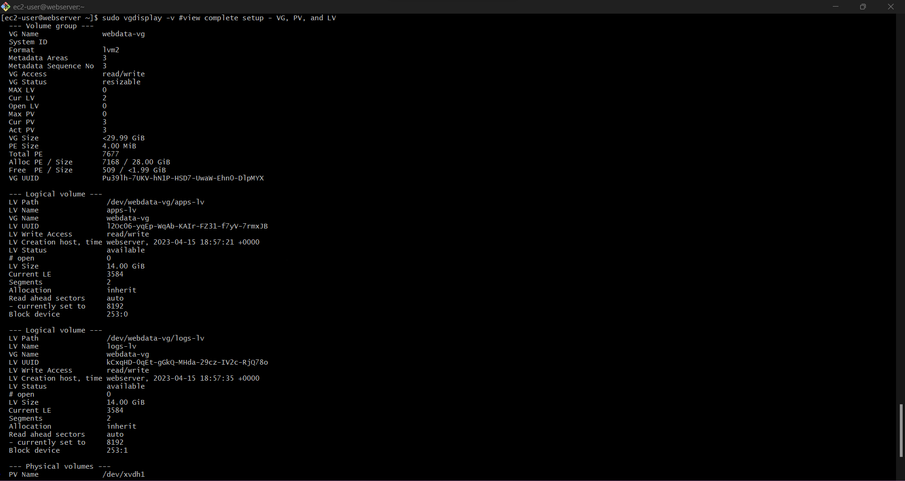

>`sudo lsblk`

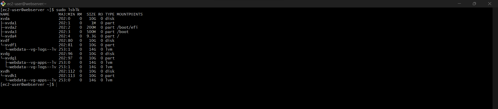

14. Use ***mkfs.ext4*** to format the logical volumes with ext4 filesystem
>`sudo mkfs -t ext4 /dev/webdata-vg/apps-lv`

>`sudo mkfs -t ext4 /dev/webdata-vg/logs-lv`

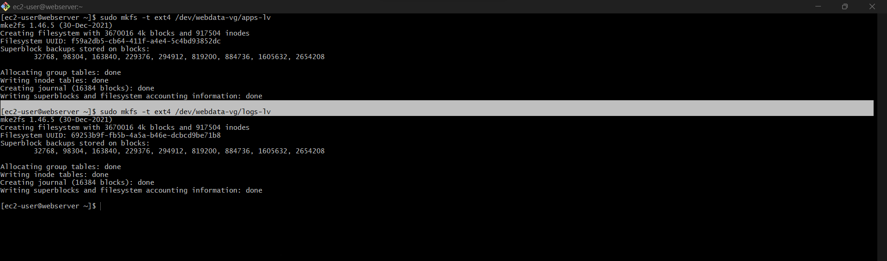

15. Create **/var/www/html** directory to store website files
>`sudo mkdir -p /var/www/html`

16. Create **/home/recovery/logs** to store backup of log data
>`sudo mkdir -p /home/recovery/logs`

17. Mount **/var/www/html** on apps-lv logical volume
>`sudo mount /dev/webdata-vg/apps-lv /var/www/html/`

18. Use **rsync** utility to backup all the files in the log directory ***/var/log into /home/recovery/logs*** (This is required before mounting the file system)
>`sudo rsync -av /var/log/. /home/recovery/logs/`

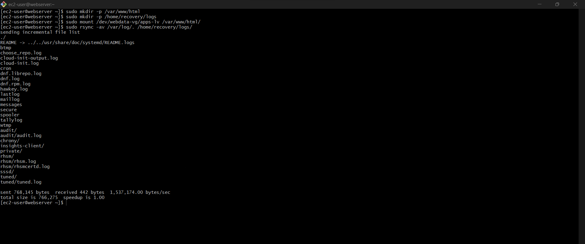

19. Mount **/var/log** on **logs-lv** logical volume. (Note that all the existing data on **/var/log** will be deleted. That is why step 15 above is very
important)
>`sudo mount /dev/webdata-vg/logs-lv /var/log`

20. Restore log files back into **/var/log** directory
>`sudo rsync -av /home/recovery/logs/. /var/log`

21. Update ***/etc/fstab*** file so that the mount configuration will persist after restart of the server.
Click on the next button To update the /etc/fstab file

#### Run `sudo blkid` and copy the 2 lines that start with ***/dev/mapper***, and paste in a notepad. Delete everything that comes after the 2nd quatation marks. For both lines.

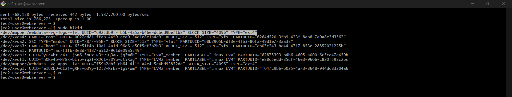

#### Then run:
>`sudo vi /etc/fstab`
And add the what you copied from `sudo blkid`

```
UUID=f59a2db5-cb64-411f-a4e4-5c4bd93852dc  /var/www/html ext4 defaults 0 0
UUID=69253b9f-fb5b-4a5a-b46e-dcbcd9be71b8
```

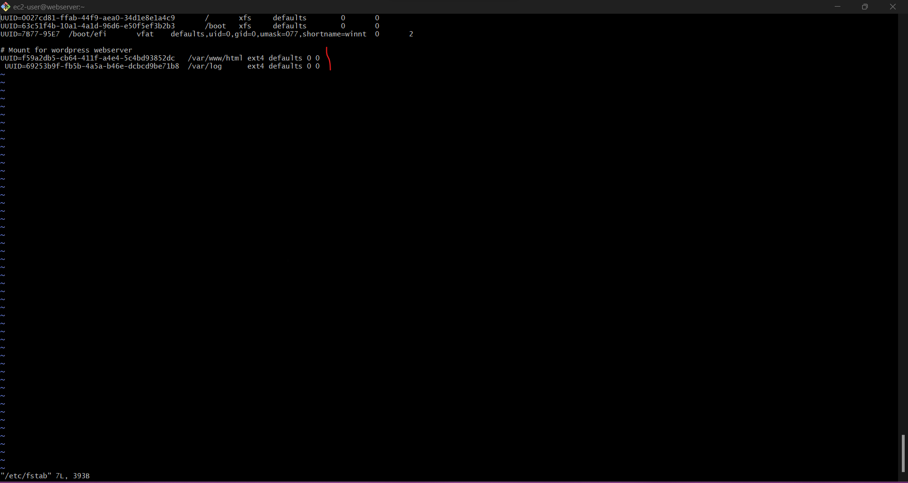
#### Then run this command to verify what we just did
>`sudo mount -a`

Reload the daemon with:
>`sudo systemctl daemon-reload`

Verify your setup by running:
>`df -h`

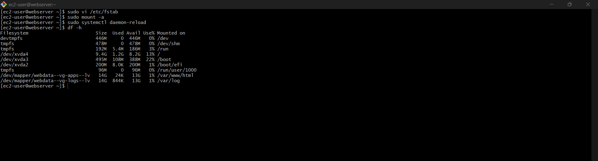

<br>

## PREPARE THE DATABASE SERVER

#### Go to Instances and copy the SSH Key for "DB Server"

#### Then go to a Terminal, `cd` to where your ***pem*** file is located and connect to the ***DB Server*** instance using the SSH Key:
>`ssh -i "Jennee-EC2.pem" ec2-user@ec2-35-179-94-141.eu-west-2.compute.amazonaws.com`


#### Next, open the ***/etc/hostname***
>`vi /etc/hostname`

#### Replace the ***IP address*** with the name ***dbserver***.
#### Click on ***esc*** and `:wq` + **enter**

#### Then run this command:
>`sudo hostname dbserver`

#### Follow steps 1-10 that we used for ***Webserver*** for ***dbserver***. Then instead of ***apps-lv*** like we did with the *webserver*, we'll create ***db-lv*** and mount it to **/db directory** instead of **/var/www/html/**.

#### The apps-lv will be used to store data for the Website while, logs-lv will be used to store data for logs.
11.  Run these commands:
>`sudo lvcreate -n db-lv -L 14G vg-database`

>`sudo lvcreate -n logs-lv -L 14G vg-database`

12. Verify that your Logical Volume has been created successfully by running
>`sudo lvs`

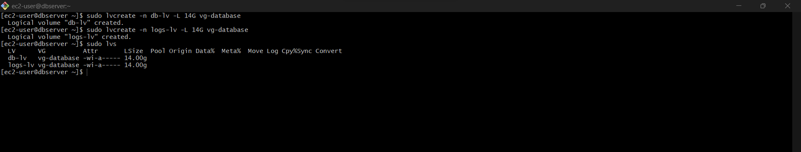

13. Verify the entire setup
>`sudo vgdisplay -v #view complete setup - VG, PV, and LV`

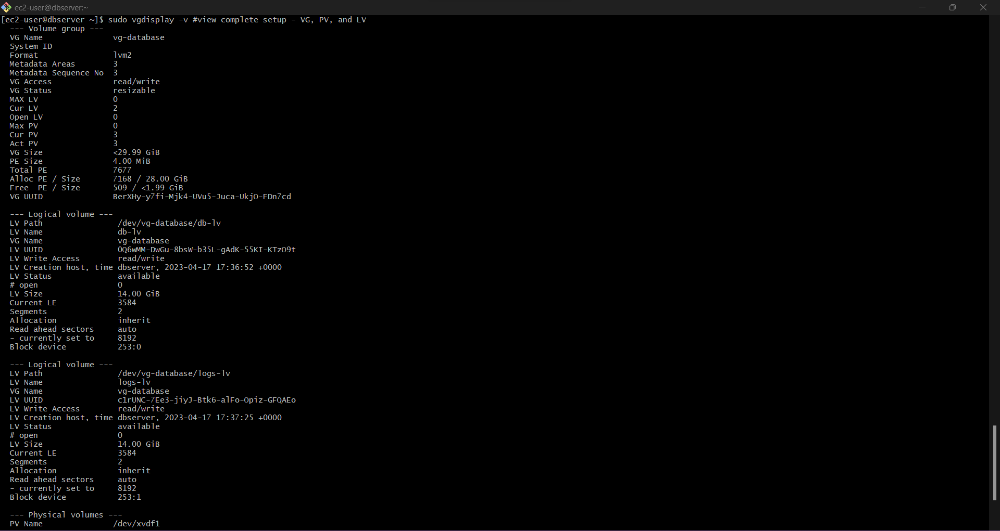

>`sudo lsblk`
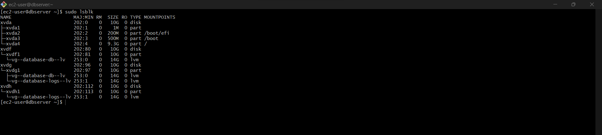

14. Use ***mkfs.ext4*** to format the logical volumes with ext4 filesystem
>`sudo mkfs -t ext4 /dev/vg-database/db-lv`

>`sudo mkfs -t ext4 /dev/vg-database/logs-lv`

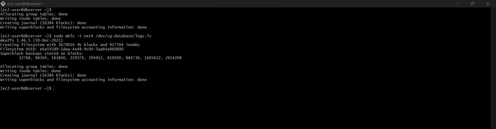

15. Create a directory named **db*. with:
>`sudo mkdir /db`

16. Create /home/recovery/logs to store backup of log data

>`sudo mkdir -p /home/recovery/logs`

17. Mount db/ on db-lv logical volume

>`sudo mount /dev/vg-database/db-lv db/`

18. Use **rsync** utility to backup all the files in the log directory ***/var/log into /home/recovery/logs*** (This is required before mounting the file system)
>`sudo rsync -av /var/log/. /home/recovery/logs/`

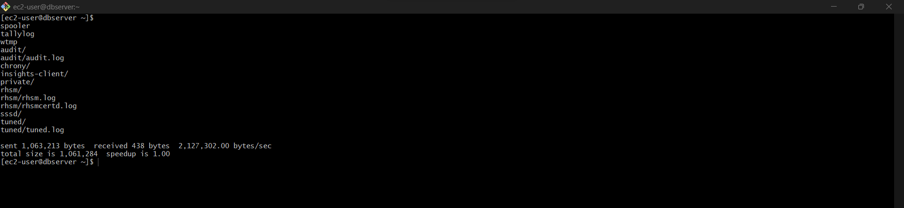

 19. Mount **/var/log** on **logs-lv** logical volume. (Note that all the existing data on **/var/log** will be deleted. That is why step 15 above is very
important)
>`sudo mount /dev/vg-database/logs-lv /var/log`

20. Restore log files back into **/var/log** directory
>`sudo rsync -av /home/recovery/logs/. /var/log`

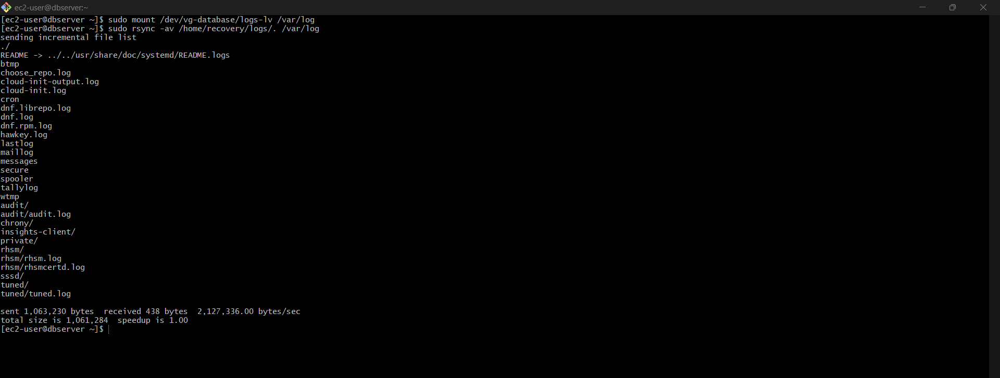

21. Update ***/etc/fstab*** file so that the mount configuration will persist after restart of the server.
Click on the next button To update the /etc/fstab file

#### Run `sudo blkid` and copy the 2 lines that start with ***/dev/mapper***, and paste in a notepad. Delete everything that comes after the 2nd quatation marks. For both lines.

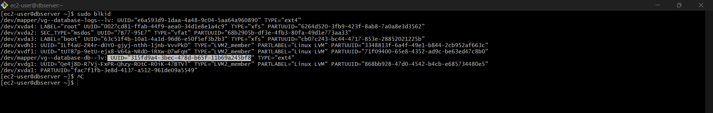

#### Then run:
>`sudo vi /etc/fstab`
And add the what you copied from `sudo blkid`

```
UUID=315fd9a4-3bec-478d-b65f-11b69a245bf8 /db ext4 defaults 0 0
```

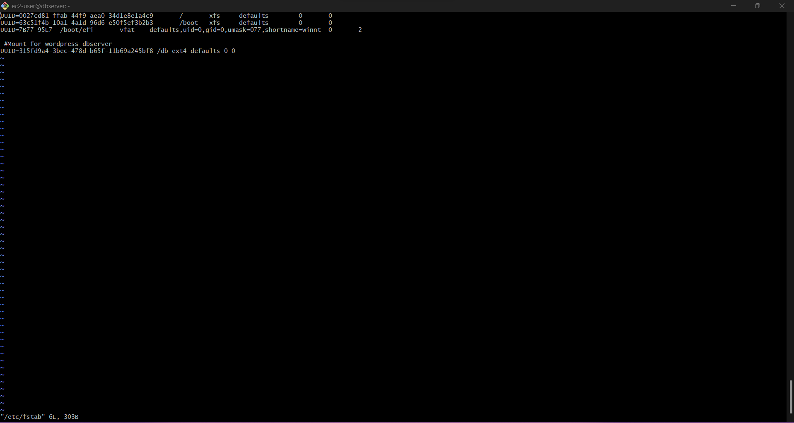

#### Then run this command to verify what we just did
>`sudo mount -a`

#### Reload the daemon with:
>`sudo systemctl daemon-reload`

#### Verify your setup by running:
>`df -h`

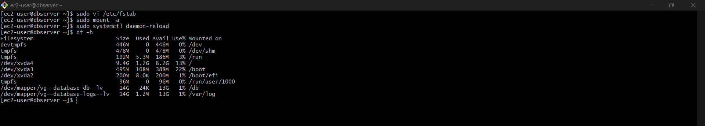

<br>